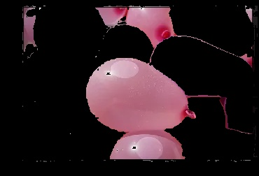
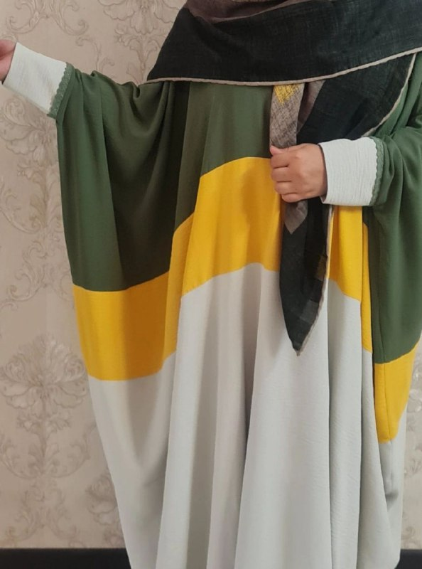
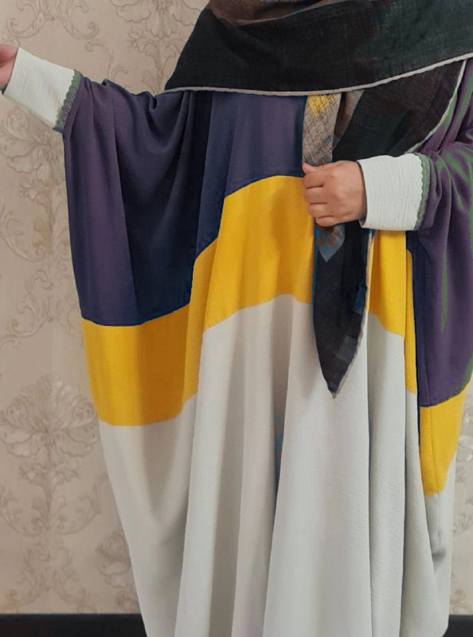
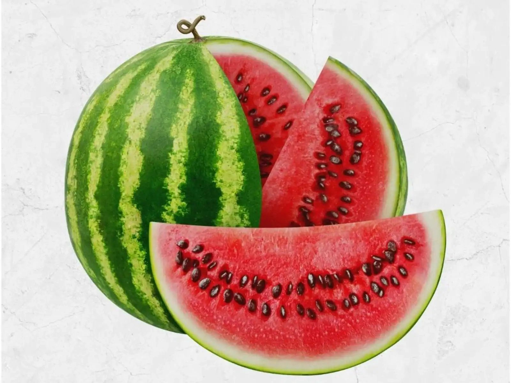
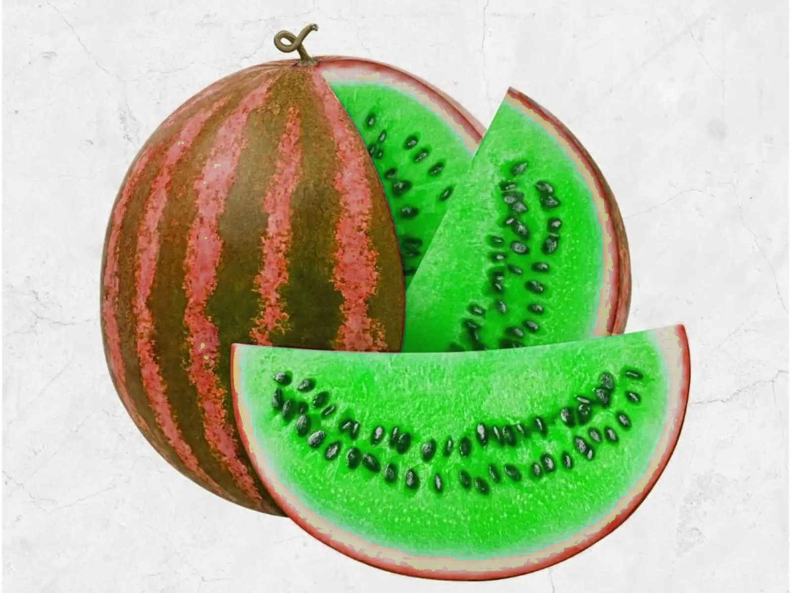
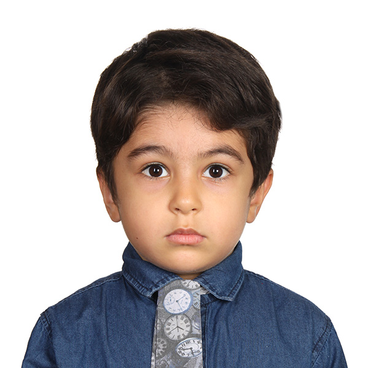
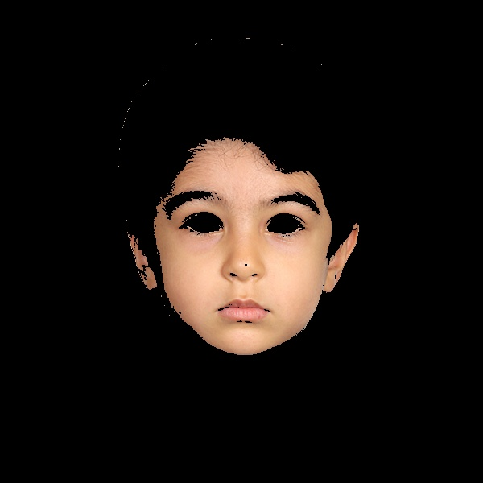

# Image Processing-HSV


simple projects using opencv with python.


## python

This project is written in Python version 3.10.8

I have used the [opencv](https://pypi.org/project/opencv-python/) and [Numpy](https://numpy.org/) 


### **How to install**
---

Run following commands:
 ```
pip install -r requierments.txt
 ```
### **My Projects**
 ---

**First**   :   **Ballons detection**


### **How to Run**
excecute this command in terminal:
 ```
 Balloons_detection\main.py
  ```
   
### **input**


---

### **result**


---



---
**Second**   :   **Change color cloths**


### **How to Run**
excecute this command in terminal:
 ```
 change_color_cloths\main.py
  ```
### **input**   


### **result**



**Theard**   :   **Materwelon_HSV**


### **How to Run**
excecute this command in terminal:
 ```
 materwelon_HSV\main.py
  ```
### **input**


### **result**
   

---

**Forth**   :   **Skin detection**


### **How to Run**
excecute this command in terminal:
 ```
 Skin_detection\main.py
  ```
### **input**   

### **result**
   

---

**Fifth**   :   **Spiderman**


### **How to Run**
excecute this command in terminal:
 ```
 spiderman\main.py
  ```
### **input**   

### **result**
   

---

